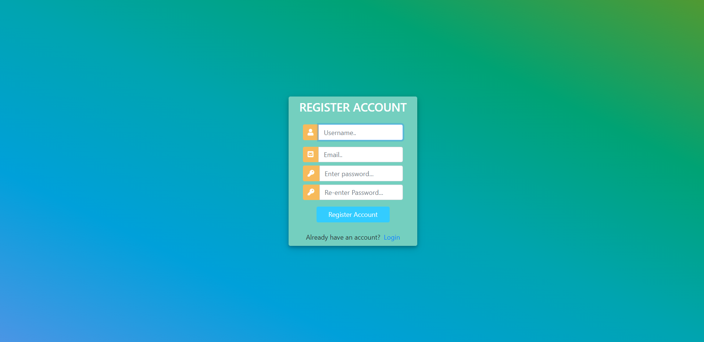
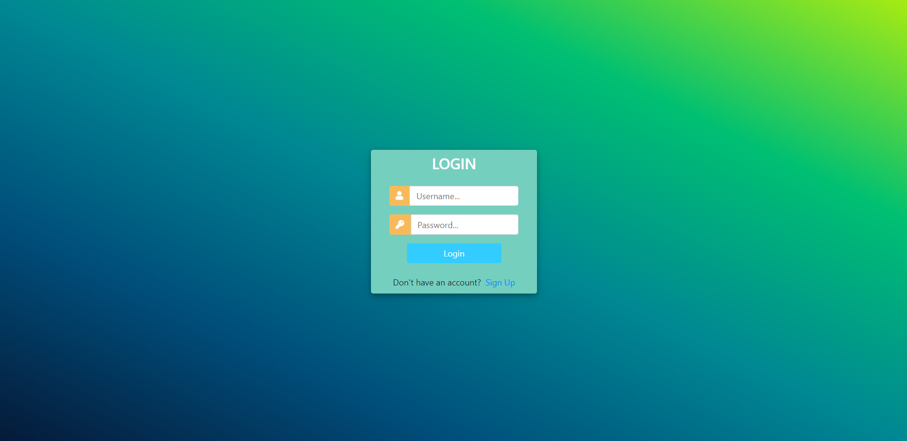
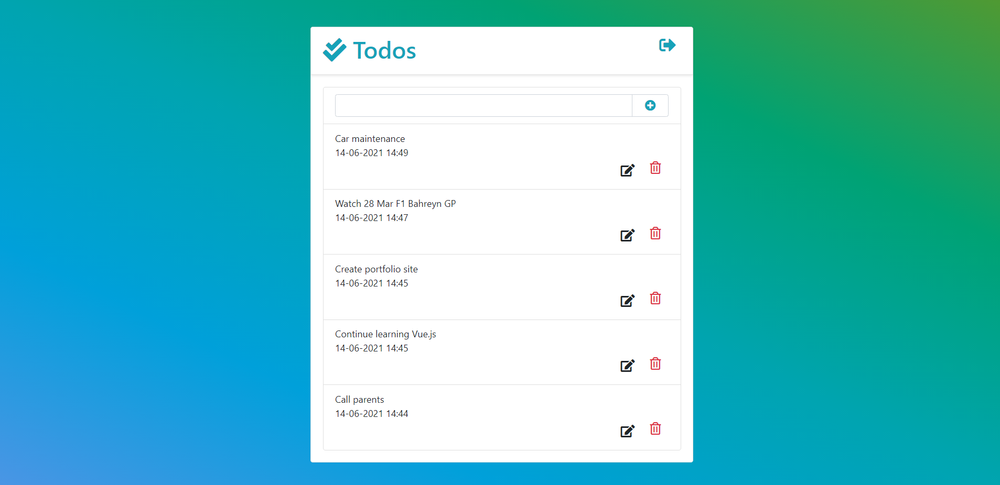
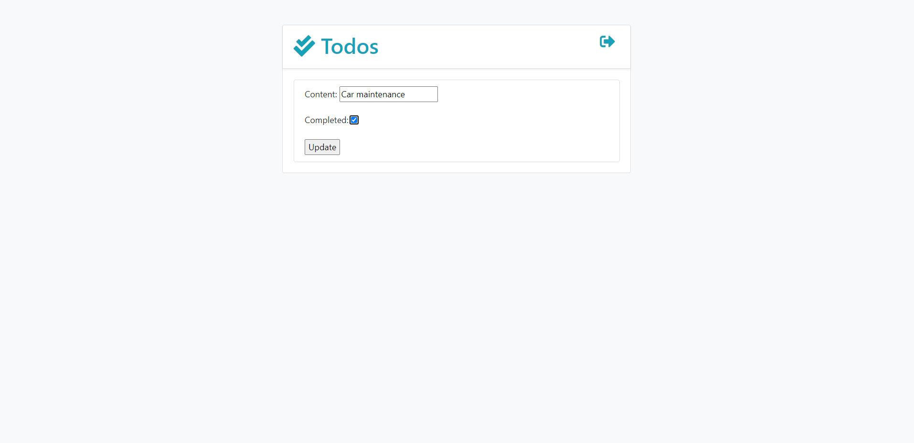
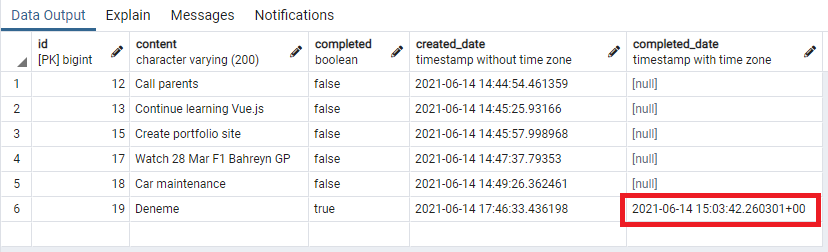

# Django Todo Project
This page contains How to build Django To-Do app with PostgreSQL.

## Requirements
* Python3
* Django
* Postgresql
* Bootstrap 4.3.1

## Run the application
1. Clone the project to your machine ```[git clone https://github.com/omur8819/djangoTodoProject.git]```
2. Navigate into the diretory ```[cd TodoProject]```
3. Install requirements [pip install -r ..\requirements.txt]
4. Run server [py manage.py runserver]
5. MainPage     : http://127.0.0.1:8000/todos/list/
6. RegisterPage : http://127.0.0.1:8000/todos/register/
7. LoginPage    : http://127.0.0.1:8000/todos/login/

## Project Pictures
### RegisterPage


### LoginPage


### TodosPage


### UpdatePage


### Database



